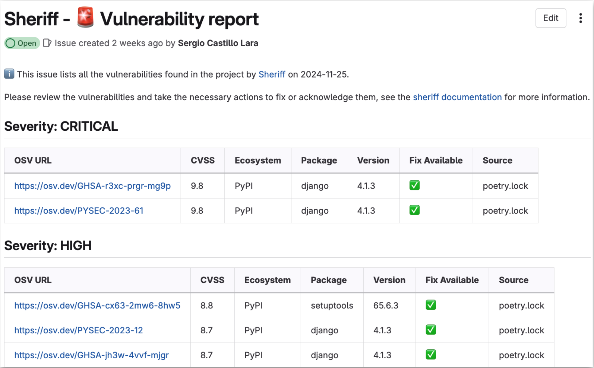
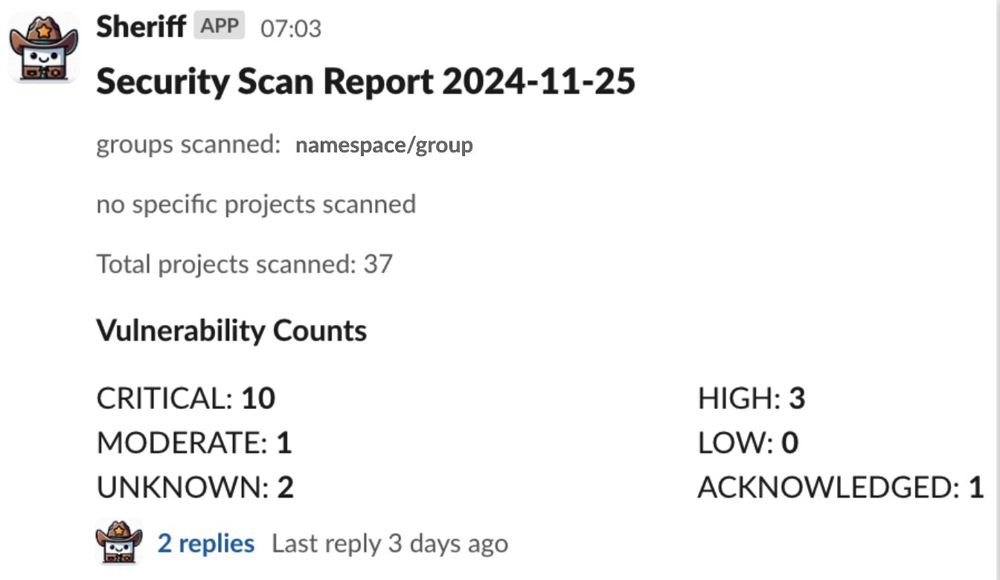
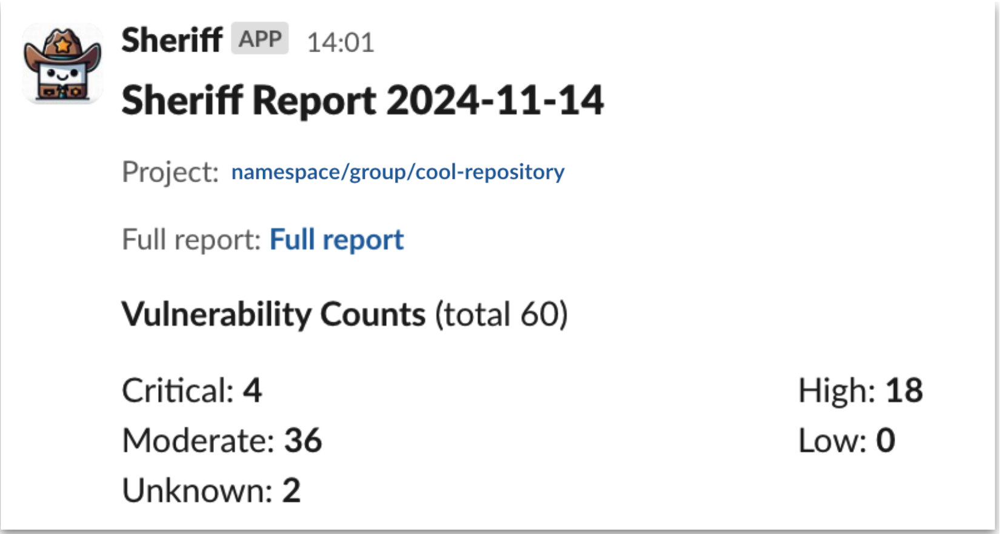

<p align="center">
  
</p>


# Sheriff

Sheriff is a tool to scan repositories and generate security reports.

- [Quick Usage](#quick-usage)
- [How it works](#how-it-works)
  - [Issue in the affected repository](#issue-in-the-affected-repository)
  - [Report message](#report-message)
  - [Specific repository message](#specific-repository-message)
- [Installation](#installation)
  - [Docker](#docker)
  - [Manual installation](#manual-installation)
- [Configuration](#configuration)
  - [CLI flags](#cli-flags)
  - [Environment variables](#environment-variables)
  - [Configuration file](#configuration-file)
- [Supported platforms](#supported-platforms)
  - [Source code hosting services](#source-code-hosting-services)
  - [Messaging services](#messaging-services)
  - [Scanners](#scanners)
- [Contributors ✨](#contributors-)

## Quick Usage

```sh
sheriff patrol --url gitlab://your-namespace-or-group --report-to-issue
```

## How it works

Sheriff analyzes repositories in source code repository hosting services (such as GitLab) looking for vulnerabilities
in the dependencies of the scanned repositories. Sheriff uses one or several third-party scanners to detect these vulnerabilities, and aggregates them into its reports. See a list of supported platforms and scanners in the [section below](#supported-platforms).

Sheriff is best used for analyzing vulnerabilities in bulk, regularly scanning groups of repositories to provide an overview of which vulnerabilities affect them. For that, Sheriff provides different types of reports, and it can publish them to different platforms such as GitLab (see [supported platforms section](#supported-platforms)).

### Issue in the affected repository

Sheriff will keep an open issue in each one of the analyzed repositories, providing a detailed report of which vulnerabilities have been found by its scanners.



### Report message

Sheriff will post a message to a messaging service with an overview of the analyzed repositories and the vulerabilities detected. This message is intended to provide a generic overview to those in charge of security to oversee the state of a given group of repositories.



### Specific repository message

Project teams can also be informed regularly by Sheriff (if they want to) by configuring a channel to which Sheriff should report its findings of a given repository. The message generated by Sheriff will be slightly different, and will contain only information relevant for the repository maintainers.



## Installation

### Docker

The easiest way to run Sheriff is through docker:

```sh
docker pull elementsinteractive/sheriff
docker run elementsinteractive/sheriff --help
```

### Manual installation

> [!NOTE]  
> If you install Sheriff manually, you will need to ensure that all the scanners used by it are available in your system

You can install Sheriff yourself by installing its dependencies, and then either downloading the binary from the [GitHub Releases page](https://github.com/elementsinteractive/sheriff/releases) or building Sheriff from source.

```sh
brew install osv-scanner
git clone git@github.com:elementsinteractive/sheriff.git
cd sheriff
go install .
```

## Configuration

Sheriff can be configured in a few different ways:

### CLI flags

The most complete way is through CLI flags. See `sheriff patrol --help` for the full list of available options.

### Environment variables

For specific sensitive configuration keys such as API tokens, Sheriff can read them from environmental variables.
Only the **Tokens** section of configuration parameters are supported for this (see `sheriff patrol --help` for the full list).

This is the case for `GITLAB_TOKEN` & `SLACK_TOKEN` for example.

### Configuration file

Sheriff also supports configuration through a TOML config file.
Only the **Reporting** and **Scanning** sections of configuration parameters are supported for this (see `sheriff patrol --help` for the full list).

In this case you may choose to create a config file such as the following:

```toml
url = ["namespace/group", "namespace/group/cool-repo"]
report-to-slack-channel = "sheriff-report-test"
report-to-gitlab-issue = true
```

And if you wish to specify a different file, you can do so with `sheriff patrol --config your-config-file.toml`.

> [!NOTE]
> When using several types of configurations at once there is an order of preference: **cli flags** > **env vars** > **config file**

## Supported platforms

### Source code hosting services

- [x] [GitLab](https://gitlab.com)
- [ ] [GitHub](https://github.com) ([#9](https://github.com/elementsinteractive/sheriff/issues/9))

### Messaging services

- [x] [Slack](http://slack.com)
- [ ] Email ([#12](https://github.com/elementsinteractive/sheriff/issues/12))

### Scanners

- [x] [OSV-Scanner](https://github.com/google/osv-scanner)
- [ ] [Trivy](https://github.com/aquasecurity/trivy)

## Contributors ✨

Thanks goes to these wonderful people ([emoji key](https://allcontributors.org/docs/en/emoji-key)):

<!-- ALL-CONTRIBUTORS-LIST:START - Do not remove or modify this section -->
<!-- prettier-ignore-start -->
<!-- markdownlint-disable -->
<table>
  <tbody>
    <tr>
      <td align="center" valign="top" width="14.28%"><a href="https://github.com/sacha-c"><br /><sub><b>Sacha Brouté</b></sub></a><br /><a href="https://github.com/elementsinteractive/sheriff/commits?author=sacha-c" title="Code">💻</a> <a href="#design-sacha-c" title="Design">🎨</a> <a href="#ideas-sacha-c" title="Ideas, Planning, & Feedback">🤔</a> <a href="#maintenance-sacha-c" title="Maintenance">🚧</a></td>
      <td align="center" valign="top" width="14.28%"><a href="https://github.com/scastlara"><br /><sub><b>Sergio Castillo</b></sub></a><br /><a href="https://github.com/elementsinteractive/sheriff/commits?author=scastlara" title="Code">💻</a> <a href="#ideas-scastlara" title="Ideas, Planning, & Feedback">🤔</a> <a href="#maintenance-scastlara" title="Maintenance">🚧</a></td>
      <td align="center" valign="top" width="14.28%"><a href="https://github.com/jbozanowski"><br /><sub><b>Jakub Bożanowski</b></sub></a><br /><a href="#ideas-jbozanowski" title="Ideas, Planning, & Feedback">🤔</a> <a href="#design-jbozanowski" title="Design">🎨</a></td>
    </tr>
  </tbody>
</table>

<!-- markdownlint-restore -->
<!-- prettier-ignore-end -->

<!-- ALL-CONTRIBUTORS-LIST:END -->

This project follows the [all-contributors](https://github.com/all-contributors/all-contributors) specification. Contributions of any kind welcome!
